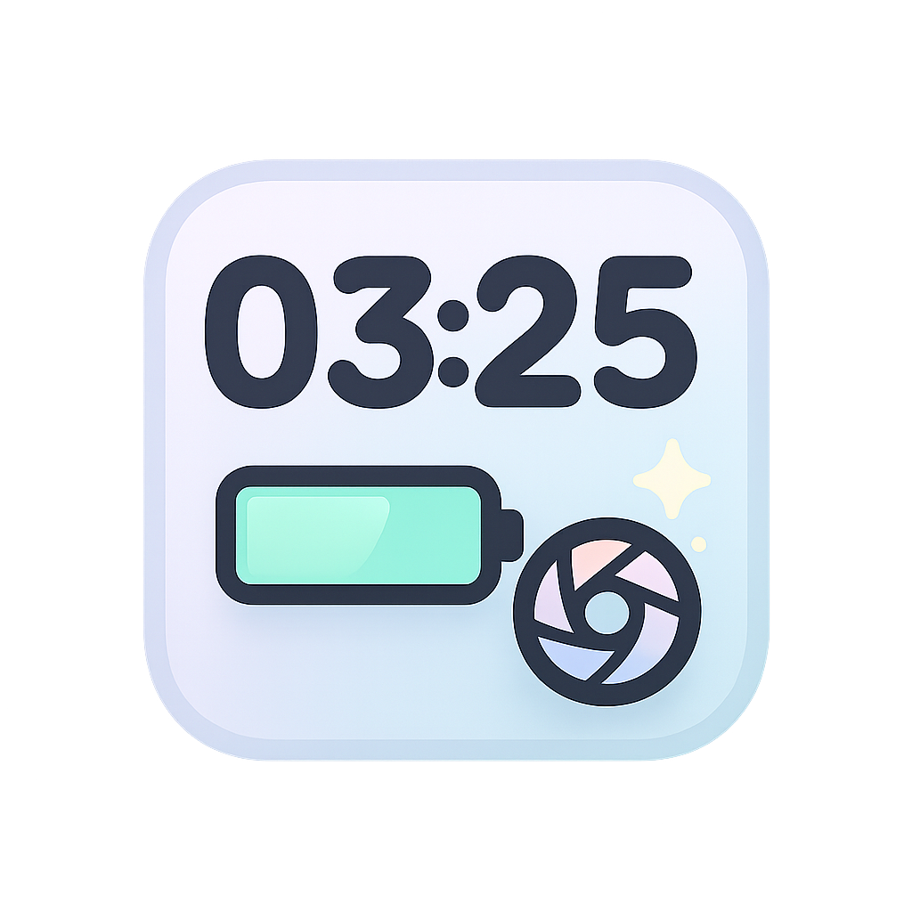
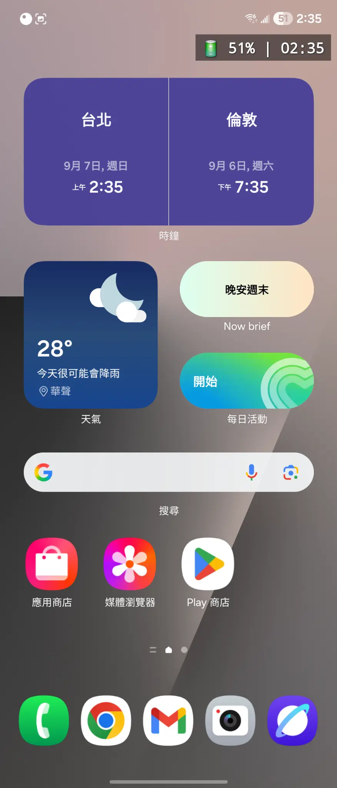
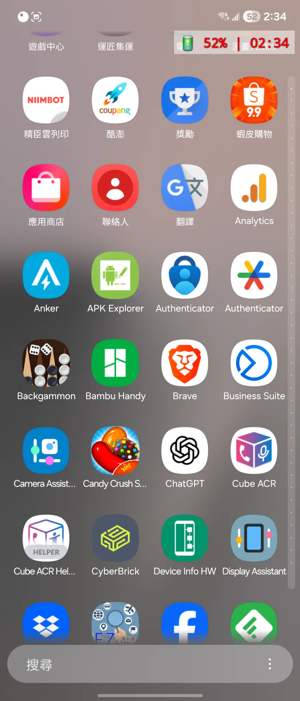
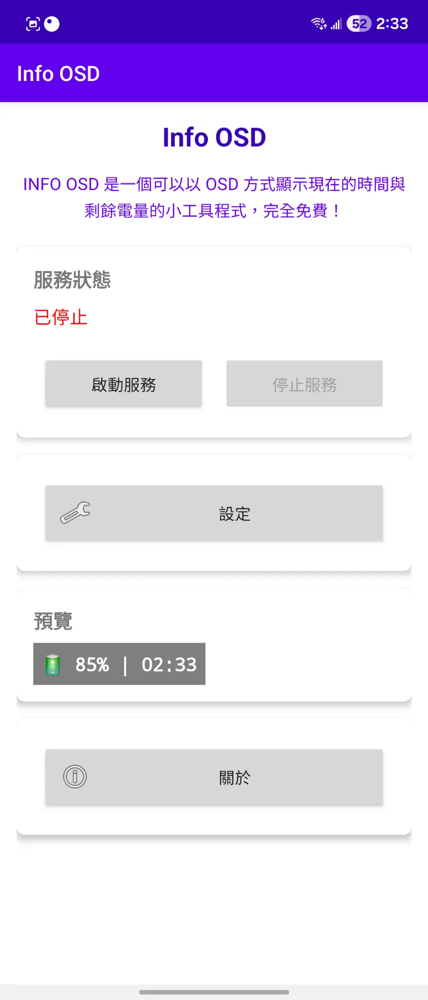
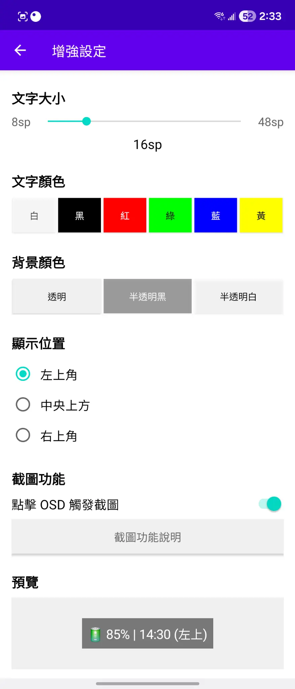
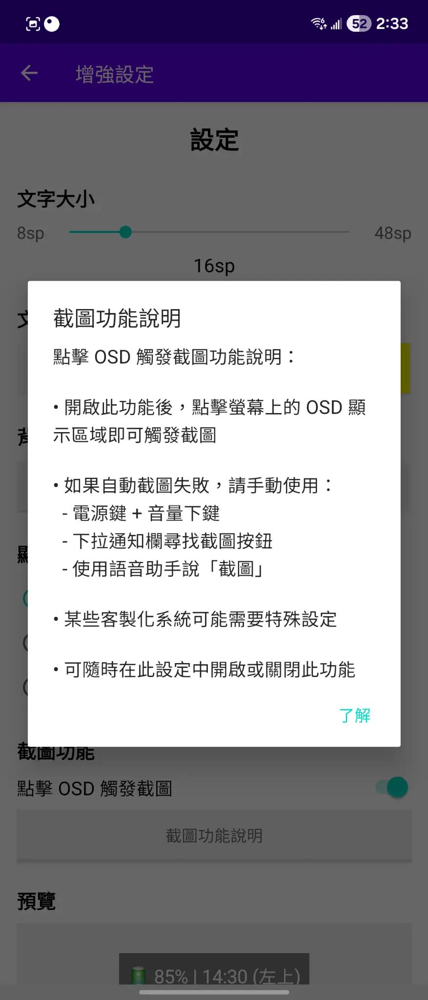

# Info OSD - Android 螢幕資訊顯示工具

<div align="center">
  
  
  <h3>🔋 電池電量 | ⏰ 時間顯示 | 📸 截圖功能</h3>
  
  <p>
    <strong>Info OSD 是一個可以以 OSD 方式顯示現在的時間與剩餘電量的小工具程式，完全免費！</strong>
  </p>
  
  <p>
    <a href="https://github.com/ahui3c/Info-OSD-Android/releases/latest">
      
    </a>
    <a href="https://github.com/ahui3c/Info-OSD-Android/releases/latest">
      
    </a>
    <a href="https://github.com/ahui3c/Info-OSD-Android/blob/main/LICENSE">
      
    </a>
  </p>
</div>

---

## 📱 應用截圖

### 🏠 OSD 顯示效果
<div align="center">
  
  
  
  <p><em>在任何畫面都能清楚顯示電池電量和當前時間</em></p>
</div>

### 🎮 應用界面
<div align="center">
  
  
  
  <p><em>簡潔直觀的中文界面，輕鬆管理所有功能</em></p>
</div>

### 📸 截圖功能展示
<div align="center">
  
  
  
  <p><em>點擊 OSD 即可觸發截圖，自動保存到系統相簿</em></p>
</div>

---

## 📱 功能特色

### 核心功能
- **🔋 電池電量顯示** - 實時顯示電池電量百分比
- **⏰ 時間顯示** - 顯示當前時間（24小時制）
- **📸 截圖功能** - 點擊 OSD 觸發截圖，自動保存到系統相簿
- **⚙️ 自定義設置** - 可調整文字大小、顏色和顯示位置
- **🔐 權限管理** - 智能的動態權限請求和管理

### 用戶體驗
- **🌏 完整中文化** - 所有界面元素都是繁體中文
- **🎨 專業圖示** - 精美的應用圖示設計
- **📱 系統整合** - 完美整合系統相簿、瀏覽器和郵件
- **🚀 低資源消耗** - 高效的服務實現，不影響系統性能
- **💯 完全免費** - 無廣告、無內購、無使用限制

## 🛠️ 技術規格

### 系統需求
- **Android 版本**: 7.0 (API 24) 或更高
- **目標 SDK**: Android 14 (API 34)
- **架構支援**: ARM64, ARM, x86, x86_64
- **權限需求**: 懸浮窗權限、媒體投影權限

### 技術特性
- **MediaProjection API** - 用於截圖功能
- **MediaStore API** - 用於圖片保存到系統相簿
- **前台服務** - 確保 OSD 穩定運行
- **動態權限** - 智能的權限請求管理
- **多密度支援** - 適配各種螢幕解析度

## 🏗️ 專案結構

```
InfoOSD/
├── app/
│   ├── src/main/
│   │   ├── java/com/infoosd/
│   │   │   ├── MainActivity.java              # 主活動
│   │   │   ├── SettingsActivity.java          # 設定活動
│   │   │   ├── OverlayService.java            # OSD 覆蓋層服務
│   │   │   ├── MinimalScreenshotService.java  # 截圖服務
│   │   │   ├── MinimalScreenshotActivity.java # 截圖權限請求
│   │   │   ├── SettingsManager.java           # 設定管理器
│   │   │   ├── PermissionManager.java         # 權限管理器
│   │   │   ├── BatteryReceiver.java           # 電池狀態接收器
│   │   │   └── BootReceiver.java              # 開機啟動接收器
│   │   ├── res/
│   │   │   ├── layout/                        # 界面布局文件
│   │   │   ├── values/                        # 字符串和樣式資源
│   │   │   ├── values-zh/                     # 繁體中文資源
│   │   │   ├── drawable/                      # 圖形資源
│   │   │   └── mipmap-*/                      # 應用圖示（多密度）
│   │   └── AndroidManifest.xml               # 應用清單文件
│   ├── build.gradle                          # 應用構建配置
│   └── proguard-rules.pro                    # 代碼混淆規則
├── gradle/                                   # Gradle 包裝器
├── build.gradle                              # 專案構建配置
├── settings.gradle                           # 專案設定
├── gradle.properties                         # Gradle 屬性
├── local.properties                          # 本地配置（需自行創建）
├── README.md                                 # 專案說明文檔
├── LICENSE                                   # 開源授權
└── DEVELOPMENT.md                            # 開發指南
```

## 🚀 快速開始

### 環境準備
1. **Android Studio** - 建議使用最新版本
2. **Android SDK** - API 24 或更高
3. **Java/Kotlin** - 支援 Java 8 或更高

### 構建步驟
1. **克隆專案**
   ```bash
   git clone https://github.com/yourusername/InfoOSD.git
   cd InfoOSD
   ```

2. **配置 Android SDK**
   創建 `local.properties` 文件：
   ```properties
   sdk.dir=/path/to/your/android-sdk
   ```

3. **構建 APK**
   ```bash
   ./gradlew assembleDebug
   ```

4. **安裝到設備**
   ```bash
   ./gradlew installDebug
   ```

### 開發環境設定
詳細的開發環境設定請參考 [DEVELOPMENT.md](DEVELOPMENT.md)

## 📖 使用說明

### 首次使用
1. **安裝應用** - 安裝 APK 文件到 Android 設備
2. **授予權限** - 允許懸浮窗顯示權限
3. **啟動服務** - 點擊「啟動服務」按鈕
4. **自定義設置** - 根據需要調整顯示設置

### 截圖功能
1. **點擊 OSD** - 點擊螢幕上的 OSD 顯示
2. **授予權限** - 首次使用時授予媒體投影權限
3. **查看截圖** - 截圖自動保存到系統相簿的 Screenshots 文件夾

### 設定選項
- **文字大小** - 調整 OSD 文字的大小
- **文字顏色** - 選擇 OSD 文字的顏色
- **顯示位置** - 設定 OSD 在螢幕上的位置

## 🔧 開發指南

### 核心組件

#### OverlayService
負責 OSD 懸浮窗的顯示和管理：
```java
public class OverlayService extends Service {
    // OSD 視圖管理
    // 電池狀態監聽
    // 時間更新邏輯
    // 點擊事件處理
}
```

#### MinimalScreenshotService
處理截圖功能的核心服務：
```java
public class MinimalScreenshotService extends Service {
    // MediaProjection 管理
    // VirtualDisplay 創建
    // 圖像捕獲和保存
    // 系統相簿整合
}
```

#### SettingsManager
管理應用設定的工具類：
```java
public class SettingsManager {
    // SharedPreferences 操作
    // 設定值的讀取和保存
    // 預設值管理
}
```

### 權限處理
應用需要以下關鍵權限：
- `SYSTEM_ALERT_WINDOW` - 懸浮窗顯示
- `FOREGROUND_SERVICE_MEDIA_PROJECTION` - 截圖服務
- `READ_MEDIA_IMAGES` - 讀取媒體文件

### 截圖流程
1. **權限請求** - 通過 MediaProjectionManager 請求權限
2. **服務啟動** - 啟動前台截圖服務
3. **虛擬顯示** - 創建 VirtualDisplay 捕獲螢幕
4. **圖像處理** - 使用 ImageReader 獲取圖像數據
5. **文件保存** - 通過 MediaStore API 保存到相簿

## 🎨 自定義開發

### 添加新功能
1. **創建新的 Service** - 繼承 Service 類
2. **註冊到 Manifest** - 在 AndroidManifest.xml 中註冊
3. **實現業務邏輯** - 編寫具體功能代碼
4. **更新 UI** - 在設定頁面添加相關選項

### 修改 OSD 樣式
編輯 `OverlayService.java` 中的視圖創建邏輯：
```java
private void createOverlayView() {
    // 自定義 OSD 外觀
    // 修改布局、顏色、字體等
}
```

### 擴展設定選項
在 `SettingsActivity.java` 和 `SettingsManager.java` 中添加新的設定項目。

## 🧪 測試

### 單元測試
```bash
./gradlew test
```

### 設備測試
```bash
./gradlew connectedAndroidTest
```

### 手動測試清單
- [ ] OSD 顯示正常
- [ ] 電池電量更新
- [ ] 時間顯示準確
- [ ] 截圖功能正常
- [ ] 設定保存生效
- [ ] 權限請求正常
- [ ] 開機自啟動

## 📦 發布

### 構建發布版本
```bash
./gradlew assembleRelease
```

### 簽名配置
在 `app/build.gradle` 中配置簽名：
```gradle
android {
    signingConfigs {
        release {
            storeFile file('your-keystore.jks')
            storePassword 'your-store-password'
            keyAlias 'your-key-alias'
            keyPassword 'your-key-password'
        }
    }
}
```

## 🤝 貢獻指南

### 如何貢獻
1. **Fork 專案** - 創建專案的分支
2. **創建功能分支** - `git checkout -b feature/new-feature`
3. **提交更改** - `git commit -am 'Add new feature'`
4. **推送分支** - `git push origin feature/new-feature`
5. **創建 Pull Request** - 提交合併請求

### 代碼規範
- 使用 Java 8+ 語法
- 遵循 Android 開發最佳實踐
- 添加適當的註釋和文檔
- 確保代碼通過所有測試

### 問題回報
請使用 GitHub Issues 回報問題，包含：
- 設備型號和 Android 版本
- 詳細的問題描述
- 重現步驟
- 相關的日誌信息

## 📄 授權

本專案採用 MIT 授權條款 - 詳見 [LICENSE](LICENSE) 文件

## 👨‍💻 作者

**廖阿輝**
- 網站: [https://ahui3c.com](https://ahui3c.com)
- 信箱: [chehui@gmail.com](mailto:chehui@gmail.com)
- 社群: FB 粉絲團與 Youtube 搜尋「3C 達人廖阿輝」

## 🙏 致謝

感謝所有為這個專案做出貢獻的開發者和使用者。

## 📚 相關資源

### Android 開發文檔
- [Android Developer Guide](https://developer.android.com/guide)
- [MediaProjection API](https://developer.android.com/reference/android/media/projection/MediaProjection)
- [Foreground Services](https://developer.android.com/guide/components/foreground-services)

### 第三方庫
本專案主要使用 Android 原生 API，未依賴第三方庫，確保應用的輕量和穩定。

## 🔄 版本歷史

### v0.1 (2025-09-07)
- ✨ 初始版本發布
- ✨ OSD 電池和時間顯示功能
- ✨ 截圖功能實現
- ✨ 自定義設置支援
- ✨ 完整中文化界面
- ✨ 專業圖示設計
- ✨ 系統相簿整合

## 🚧 未來計劃

### 短期目標
- [ ] 添加更多 OSD 顯示選項（CPU、記憶體使用率）
- [ ] 支援更多截圖格式和品質設定
- [ ] 添加主題和外觀自定義
- [ ] 優化電池消耗

### 長期目標
- [ ] 支援 Android 15+ 新特性
- [ ] 添加雲端同步功能
- [ ] 開發 Wear OS 版本
- [ ] 國際化支援（多語言）

## 📞 支援

如果您在使用過程中遇到問題或有建議，歡迎：
- 創建 GitHub Issue
- 發送郵件到 chehui@gmail.com
- 在社群媒體上聯繫我們

---

**讓您的 Android 設備更加智能便捷！** 🚀

