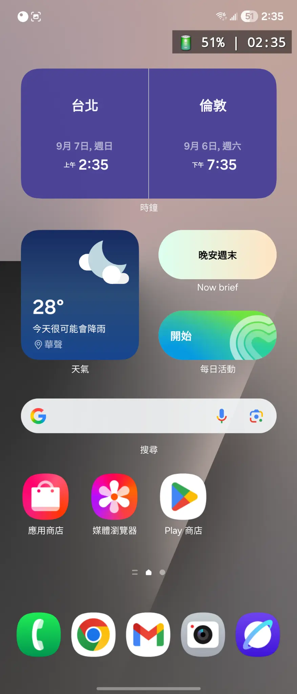
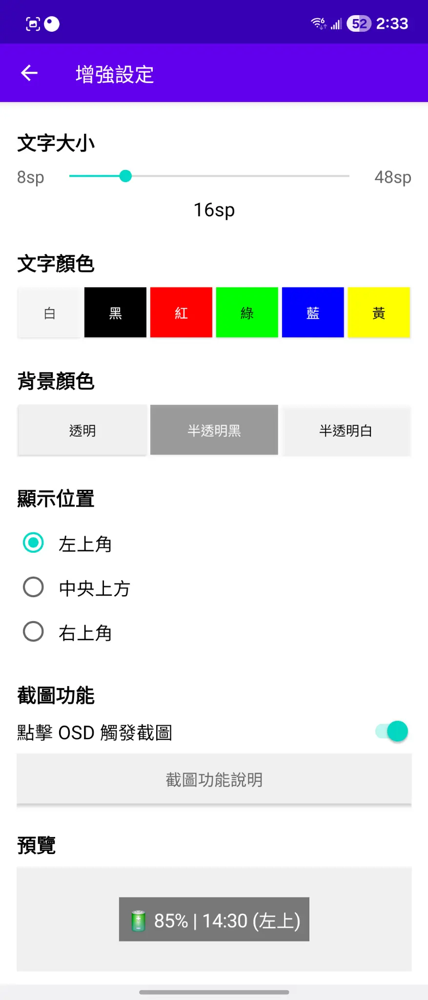

# Info OSD - Android Screen Information Display Tool

<div align="center">
  
  
  <h3>🔋 Battery Level | ⏰ Time Display | 📸 Screenshot Function</h3>
  
  <p>
    <strong>Info OSD is a small utility that displays current time and remaining battery level in OSD format, completely free!</strong>
  </p>
  
  <p>
    <a href="https://github.com/ahui3c/Info-OSD-Android/releases/latest">
      
    </a>
    <a href="https://github.com/ahui3c/Info-OSD-Android/releases/latest">
      
    </a>
    <a href="https://github.com/ahui3c/Info-OSD-Android/blob/main/LICENSE">
      
    </a>
  </p>
</div>

---

## 🌐 Language / 語言選擇

- [繁體中文](README.md) | **English**

---

## 📱 App Screenshots

### 🏠 OSD Display Effects
Clear display of battery level and current time on any screen without interfering with normal usage

<div align="center">
  <table>
    <tr>
      <td align="center">
        
        <br>
        <sub><b>Home Screen Display</b></sub>
      </td>
      <td align="center">
        
        <br>
        <sub><b>App List Display</b></sub>
      </td>
    </tr>
  </table>
</div>

### 🎮 App Interface
Clean and intuitive Chinese interface for easy function management

<div align="center">
  <table>
    <tr>
      <td align="center">
        
        <br>
        <sub><b>Main Interface</b></sub>
      </td>
      <td align="center">
        
        <br>
        <sub><b>Settings Interface</b></sub>
      </td>
    </tr>
  </table>
</div>

### 📸 Screenshot Function Demo
Tap OSD to trigger screenshot, automatically saved to system gallery

<div align="center">
  <table>
    <tr>
      <td align="center">
        
        <br>
        <sub><b>In-Game Screenshot Demo</b></sub>
      </td>
      <td align="center">
        
        <br>
        <sub><b>Screenshot Function Help</b></sub>
      </td>
    </tr>
  </table>
</div>

---

## ✨ Features

### 🎯 Core Functions
- **🔋 Battery Level Display** - Real-time battery percentage display
- **⏰ Time Display** - Current time display (24-hour format)
- **📸 Screenshot Function** - Tap OSD to trigger screenshot, auto-save to system gallery
- **⚙️ Custom Settings** - Adjustable text size, color, and display position
- **🔐 Permission Management** - Smart dynamic permission requests and management

### 🌟 User Experience
- **🌏 Full Chinese Localization** - All interface elements in Traditional Chinese
- **🎨 Professional Icon** - Beautiful app icon design
- **📱 System Integration** - Perfect integration with system gallery, browser, and email
- **🚀 Low Resource Usage** - Efficient service implementation without affecting system performance
- **💯 Completely Free** - No ads, no in-app purchases, no usage restrictions

---

## 🛠️ Technical Specifications

### System Requirements
- **Android Version**: 7.0 (API 24) or higher
- **Target SDK**: Android 14 (API 34)
- **Architecture Support**: ARM64, ARM, x86, x86_64
- **Required Permissions**: Overlay permission, Media projection permission

### Technical Features
- **MediaProjection API** - For screenshot functionality
- **MediaStore API** - For saving images to system gallery
- **Foreground Service** - Ensures stable OSD operation
- **Dynamic Permissions** - Smart permission request management
- **Multi-density Support** - Adapts to various screen resolutions

---

## 🚀 Quick Start

### 📥 Download & Install
1. **Download APK** - Get the latest version from [Releases page](https://github.com/ahui3c/Info-OSD-Android/releases/latest)
2. **Install App** - Allow installation from unknown sources, then install the APK file
3. **Grant Permissions** - Allow overlay display permission on first launch
4. **Start Using** - Tap "Start Service" button to begin using

### 🎮 Usage Instructions
1. **Start Service** - Tap "Start Service" on the main interface
2. **View OSD** - Battery level and time will be displayed on screen
3. **Screenshot Function** - Tap the OSD area to trigger screenshot
4. **Custom Settings** - Adjust display options in the settings page

---

## 🏗️ Project Structure

```
InfoOSD/
├── app/
│   ├── src/main/
│   │   ├── java/com/infoosd/
│   │   │   ├── MainActivity.java              # Main activity
│   │   │   ├── SettingsActivity.java          # Settings activity
│   │   │   ├── OverlayService.java            # OSD overlay service
│   │   │   ├── MinimalScreenshotService.java  # Screenshot service
│   │   │   ├── MinimalScreenshotActivity.java # Screenshot permission request
│   │   │   ├── SettingsManager.java           # Settings manager
│   │   │   ├── PermissionManager.java         # Permission manager
│   │   │   ├── BatteryReceiver.java           # Battery status receiver
│   │   │   └── BootReceiver.java              # Boot startup receiver
│   │   ├── res/
│   │   │   ├── layout/                        # UI layout files
│   │   │   ├── values/                        # String and style resources
│   │   │   ├── values-zh/                     # Traditional Chinese resources
│   │   │   ├── drawable/                      # Graphic resources
│   │   │   └── mipmap-*/                      # App icons (multi-density)
│   │   └── AndroidManifest.xml               # App manifest file
│   ├── build.gradle                          # App build configuration
│   └── proguard-rules.pro                    # Code obfuscation rules
├── gradle/                                   # Gradle wrapper
├── build.gradle                              # Project build configuration
├── settings.gradle                           # Project settings
├── gradle.properties                         # Gradle properties
├── local.properties                          # Local configuration (create yourself)
├── README.md                                 # Project documentation
├── LICENSE                                   # Open source license
└── DEVELOPMENT.md                            # Development guide
```

---

## 🔧 Development Guide

### Environment Setup
1. **Android Studio** - Latest version recommended
2. **Android SDK** - API 24 or higher
3. **Java/Kotlin** - Java 8 or higher support

### Build Steps
1. **Clone Project**
   ```bash
   git clone https://github.com/ahui3c/Info-OSD-Android.git
   cd Info-OSD-Android
   ```

2. **Configure Android SDK**
   Create `local.properties` file:
   ```properties
   sdk.dir=/path/to/your/android-sdk
   ```

3. **Build APK**
   ```bash
   ./gradlew assembleDebug
   ```

4. **Install to Device**
   ```bash
   ./gradlew installDebug
   ```

### Detailed Development Guide
For more development information, please refer to:
- [Development Guide (DEVELOPMENT_EN.md)](DEVELOPMENT_EN.md) | [中文版本](DEVELOPMENT.md)
- [Build Guide (BUILD_EN.md)](BUILD_EN.md) | [中文版本](BUILD.md)
- [Project Structure (PROJECT_STRUCTURE_EN.md)](PROJECT_STRUCTURE_EN.md) | [中文版本](PROJECT_STRUCTURE.md)

---

## 🤝 Contributing

We welcome all forms of contributions! Please refer to:
- [Contributing Guide (CONTRIBUTING_EN.md)](CONTRIBUTING_EN.md) | [中文版本](CONTRIBUTING.md)

### How to Contribute
1. **Fork Project** - Create project branch
2. **Create Feature Branch** - `git checkout -b feature/new-feature`
3. **Commit Changes** - `git commit -am 'Add new feature'`
4. **Push Branch** - `git push origin feature/new-feature`
5. **Create Pull Request** - Submit merge request

### Issue Reporting
Please use GitHub Issues to report problems, including:
- Device model and Android version
- Detailed problem description
- Reproduction steps
- Related log information

---

## 📄 License

This project is licensed under the MIT License - see the [LICENSE](LICENSE) file for details

---

## 👨‍💻 Author

**Liao Ahui (廖阿輝)**
- Website: [https://ahui3c.com](https://ahui3c.com)
- Email: [chehui@gmail.com](mailto:chehui@gmail.com)
- Social: Search "3C 達人廖阿輝" on Facebook and YouTube

---

## 🙏 Acknowledgments

Thanks to all developers and users who have contributed to this project.

---

## 📚 Related Resources

### Android Development Documentation
- [Android Developer Guide](https://developer.android.com/guide)
- [MediaProjection API](https://developer.android.com/reference/android/media/projection/MediaProjection)
- [Foreground Services](https://developer.android.com/guide/components/foreground-services)

### Project Documentation
- [Changelog (CHANGELOG_EN.md)](CHANGELOG_EN.md) | [中文版本](CHANGELOG.md)

---

## 🔄 Version History

### v0.1 (2025-09-07)
- ✨ Initial release
- ✨ OSD battery and time display functionality
- ✨ Screenshot function implementation
- ✨ Custom settings support
- ✨ Complete Chinese localization interface
- ✨ Professional icon design
- ✨ System gallery integration

---

## 🚧 Future Plans

### Short-term Goals
- [ ] Add more OSD display options (CPU, memory usage)
- [ ] Support more screenshot formats and quality settings
- [ ] Add theme and appearance customization
- [ ] Optimize battery consumption

### Long-term Goals
- [ ] Support Android 15+ new features
- [ ] Add cloud sync functionality
- [ ] Develop Wear OS version
- [ ] Internationalization support (multi-language)

---

## 📞 Support

If you encounter problems or have suggestions during use, please:
- Create GitHub Issue
- Send email to chehui@gmail.com
- Contact us on social media

---

<div align="center">
  <h3>🚀 Make your Android device smarter and more convenient!</h3>
  
  <p>
    <a href="https://github.com/ahui3c/Info-OSD-Android/releases/latest">
      
    </a>
  </p>
</div>

